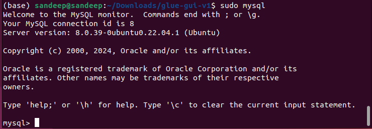

GLUE-GUI is a graphical user interface designed for running RABV-GLUE, specifically to facilitate GenBank submissions for rabies sequences. In addition to supporting GenBank submissions, GLUE-GUI has been updated with the latest rabies sequences and can perform database queries similar to those available on the RABV-GLUE website (http://rabv-glue.cvr.gla.ac.uk/).

# Installation
GLUE_GUI is developed in Java, so having Java installed is essential. We recommend using Conda to run GLUE-GUI, which makes the installation process simple. For ease of installation, the install.sh script performs the following tasks:
- Install curl if it does not exist
- Install Conda/miniforge if it does not exist
- Create an environment gluetools (which contains RAxML, BLAST, MAFFT, TBLASTN)
- Create an environment glue-gui (which contains Java)
- Download the JavaFX SDK depending on the OS and architecture

## MySQL installation on Mac OS
Select the appropriate version of the MySQL Community Server according to your operating system. Gluetools recommends MySQL Community Server 8.0.39, which can be found at the link below. 

```shell
https://dev.mysql.com/downloads/mysql/
```
Setup the mySQL with appropriate root user and credentials for the error free post setups.

## MySQL installation on Linux (Ubuntu OS)
Run the below commands one-by-one.

```shell
sudo apt update
sudo apt install mysql-server
sudo systemctl start mysql.service
```

Once the installation is finish run the below.
```shell
sudo mysql
```

Your terminal should look something like this



Run the below command and exit from mySQL. Presently the root password is set to root@123. Feel free to change it. 
```shell
ALTER USER 'root'@'localhost' IDENTIFIED WITH mysql_native_password BY 'root@123';
exit
```
<b>Note</b>: The tool also creates the mysql user 'gluetools' with password 'Password123#@!'. It is highly not recommended to change password, otherwise the program may not work.

Securly store MySQL login credentials without exposing the password in plain text. This will enable the tool to access the glue_tools database without credentials.

```shell
 mysql_config_editor set --login-path=local --host=localhost --user=root --password
```
## Download and setup the environments

Download the https://drive.google.com/file/d/1hBY2FhuA1ieBAeHwx-7CW51ZoVExqCQz/view?usp=sharing
```shell
unzip glue-gui-v1.zip
cd glue-gui-v1
bash install.sh
conda activate glue-gui
```

### Launching the GUI
```shell
bash glue-gui.sh
```

The successful installation will launch the GLUE-GUI. 

### Initial setups for GUI

The first time GUI launch will require few things to be setup such as path of the gluetools jar file and its configuration files.

#### Setting up the glue and path
goto-->settings-->Set glue and DB --> browse the gluetools jar and configuration files from gluetoos_jar_file directory with the GLUE-GUI

## Running the analysis
At this moment, Glue-GUI provides two functions. 1) maxLikeHoodGenotyper and 2) genBankSubmission. 

maxLikeHoodGenotyper requires rabies fasta file to tell which alignment the sequence belongs. 

genBankSubmission function, generates the GenBank sequence submission files (*.SQN). It uses the latest table2asn tool to generate the SQN files. It requires fasta file directory, submission template and tabular file as an input to generate the SQN files.

Directory named test_data provides the data necessary to run the GenBank submission test. Also the maxLikeHoodGenotyper can be tested by uploading fasta file available on test_data/fasta-seq directory. 


